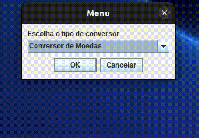

<h1 align="center"> Conversor de Moedas e Temperaturas </h1>

Desafio de projeto de um conversor de moedas 💰️ e de temperaturas 🌡️, com a utilização de interface gráfica do pacote javax.swing do Java, proposto pelo programa ONE - Oracle Next Education - Turma 5, em uma parceria da Alura com a Oracle.

# 🗂️ Índice 

* Descrição do Projeto e Funcionalidades
* Demonstração da Aplicação
* Tecnologias utilizadas
* Desenvolvedor

# 🔨 Descrição do Projeto e Funcionalidades #

Este projeto consta em um simples aplicativo de conversão. Nele, é possível escolher tanto o conversor de moedas quanto o de temperaturas. No conversor de moedas, é possível:
- `Converter de Reais a Dólar`
- `Converter de Reais a Euro`
- `Converter de Reais a Libras Esterlinas`
- `Converter de Reais a Peso argentino`
- `Converter de Reais a Peso Chileno`
  
assim como de forma inversa:
- `Converter de Dólar a Reais`
- `Converter de Euro a Reais`
- `Converter de Libras Esterlinas a Reais`
- `Converter de Peso argentino a  Reais`
- `Converter de Peso Chileno a Reais`

Já no conversor de temperaturas, é possível:
- `Converter de Celsius para Kelvin`
- `Converter de Celsius para Fahrenheit`
- `Converter de Kelvin para Celsius`
- `Converter de Kelvin para Fahrenheit`
- `Converter de Fahrenheit para Celsius`
- `Converter de Fahrenheit para Kelvin`

# 👀 Demonstração da Aplicação

# 🧑‍💻 Tecnologias utilizadas

  

  

# 👨‍💻 Desenvolvedor

[ Anderson Bezerra da Rocha](https://github.com/ANDERSONROCHA81)
